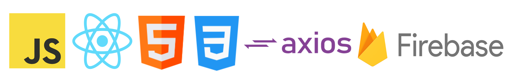

# Netflix Clone - React.JS

This project was created with [Create React App](https://github.com/facebook/create-react-app).

This project uses Axios to fetch movies from the TMDB = The Movie Data Base API to list them in the Netflix clone.<br/>
And the project is deployed and hosted using Google's Firebase.<br/>
The dependencies are React/Youtube and Movie-Trailer to get the trailers from Youtube and diplay them based on the movie you click on.<br/>

## Technologies Used

In the project directory, you can see the following technologies:

<p align="center">

</p>

# Installation

After downloading it to your local computer you have to download the dependencies listed in the package.json.

using NPM:

```sh
npm install
```

using Yarn

```sh
yarn add
```

## Learn More

You can test it in your machine using: [NetFlix-Clone](https://netflix-clone-db8b5.web.app/).

# License

© Feito com muito &#10084; por [Ramon Pereira](https://www.linkedin.com/in/ramon-pereira88/) 🤝
